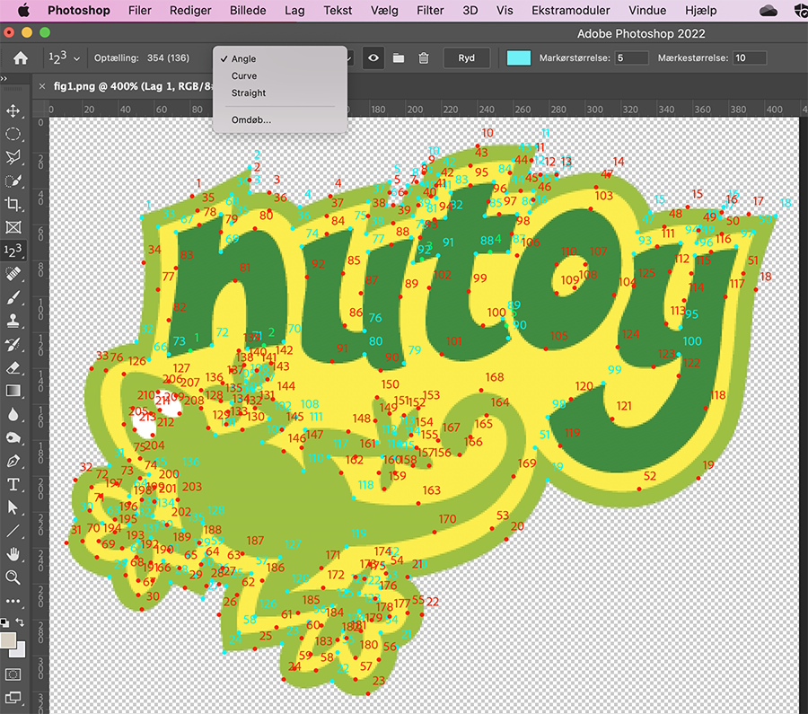

This document is a companion to the research article "Gender-stereotypes expressed through graphic shape and typography in toy brand logos" (under preparation), by Christian Mosbæk Johannessen, Mads Nedergaard Qwist and Karen Hvidtfeldt, University of Southern Denmark.

***
```{r include=FALSE}
library(rmarkdown)
library(tibble)
library(reactable)
library(kableExtra)
library(flextable)
library(dplyr)
```

# 1. Introduction
This document provides the necessary background for understanding how a sample of toy brand logos was annotated and analysed in the study behind the artice. To illustrate the procedure we created the logo for a fictional new brand called "nutoy" (shown as figure 1).


# 2. Procedure
The sample used in the study consists of *n*=50 photographs of toy packagings cropped to show only the brand logos. These were analyzed with the tools `count`and `measure` in Adobe Photoshop. Values were input to an Excel spreadsheet and subsequently exported as a comma separated file to be loaded into RStudio for calculations and statistical analysis.

The purpose of this analysis is to arrive at a quantification of so-called "distinctive features" of typography @vanleeuwent2006 and shape, which allows direct comparison of logos. The analyzed features are: Weight, tension, contrast, expansion, orientation, slope, connectivity, density, straightness, angularity and curvature.

## 2.1. Icotype and logotype
At the most general level of description we distinguish two different kinds of elements: Logotype and icotype, inspired by marketing semiotician Benoit Heilbrunn  @heilbrunnb2001. How these combine into a logo is illustrated in figure 2.

Most logos are multimodal assemblages of both kinds of elements, but in many cases they consist only of a verbal component (the brand's proper name---which is given some kind of graphical and typographical treatment to make it is visually distinct). In very rare cases, logos consist only of pictorial elements. Annotating the logotype and icotype elements in the logo is important if we want to analyze how, for example, graphic shape is used to create cohesion across elements from different canvases. The framing device, which surrounds both icotype and logotype does not yet have a label in this nomenclature. Its function is neither verbal nor pictorial. Rather, it is a cohesive device.


## 2.2. Measures for typographical analysis: Letter and stroke levels
The analysis of typography is performed on the logotype, not the icotype. It breaks the logotype down into individual letter-units, for example `n`, `u`, `t`, `o`, and `y`, and breaks these further down into stroke-units. For example, as shown in figure 3, the letter `n` consists of two strokes, `n1`and `n2` (the same is true for `u`, `t` and `y`). The letter `o`, however, consists of a single stroke, `o1`. The logotype "nutoy" consists of 9 strokes total, as shown in figure 3.

{width=50%}

The resulting data frame is formatted with *one observation per stroke*. In order to split the data (for calculations of contrast ration, see [section X.X.X](#contrast)), the stroke designation, e.g. `n1`is split into two variables in the data frame, one for letter, one for stroke.

In our data management workflow, this data was entered into an Excel spread sheet, which was subsequently stored as a `.csv-file` and loaded into R for further analysis. For the sake of this explanation, we type the data directly into a so-called "tibble" (a fancy R data frame) called `df.type`.

Notice that we include a variable called `Collection`to distinguish our independent variable, gender. The nutoy logo is fictional, so we have decided it is "neutral".

```{r}
#This chunks sets up a tibble containing the letter and strokes observations in the "nutoy" logo.

c <- c("neutral" , "neutral" , "neutral" , "neutral" , "neutral" , "neutral" , "neutral" , "neutral" , "neutral")
l <- c("nutoy" , "nutoy" , "nutoy" , "nutoy" , "nutoy" , "nutoy" , "nutoy" , "nutoy" , "nutoy")
let <- c("n" , "n" , "u" , "u" , "t" , "t" ,  "o" , "y" , "y")
s <- c(1 , 2 , 1 , 2 , 1 , 2 , 1 , 1 , 2)
df.type <- tibble(Collection = c, Logo = l, Letter = let, Stroke = s)
rm(c,l,let,s)

print(df.type)
```

### 2.2.1. Measures at the letter level
We make a number of measurements to characterize letter proportions. These are necessary for calculating `slope`, `expansion`, and `orientation` (and also `weight`, which we cover in section [2.2.2.](#stroke)).

In order to perform the measurements, the so-called "baseline", "midline", "ascender height", and "descender height" of the letters in question need to be determined. This is challenging in many cases in this study, because the sampled logos exhibit a large degree of irregularity. Figure 6 shows how judgment on the part of the annotator is required in order to determine a best fitting line for baseline and midline in the nutoy logo (compared with the much more regular Arial Black), because the letters jump up and down. If one is using more than one annotator, this requires attention to interrater agreement.

{width=75%}

*X-height (x)*: The distance (in pixels) between the baseline and the midline. This is measured once per logotype (so in practice we input the same value on the x-height variable for all observations in our Excel sheet). In the "nutoy" logo, the measured x-height is 72 pixels.
```{r}
df.type$xheight <- c(72, 72, 72, 72, 72, 72, 72, 72, 72)
```
*Body height (b)*: The distance (in pixels) between the ascender height and the descender height. This is measured once per logotype. In the "nutoy" logo, the measured body height is 161 pixels.
```{r}
df.type$bodyheight <- c(161, 161, 161, 161, 161, 161, 161, 161, 161)
```
*Letter width (l)*: The width (in pixels) of a box bounding the part of the letter within baseline and midline. This is measured for each letter and since *averaged* for the whole logotype. Notice that we input letter width on all observations pertaining to that letter (because R does not like empty cells or "N/As".
```{r}
df.type$letwidth <- c(63, 63, 62, 62, 58, 58, 60, 58, 58)
```
*Slope angle (s)*: The angle (in degrees) between the baseline and the stem angle. This is measured once for each letter and *averaged* for the whole logotype. A value of 90$^\circ$ means the stem is at a right angle to the baseline. <90$^\circ$ means the stem slants to the right.
```{r}
df.type$slope <- c(85, 85, 85, 85, 79, 79, 77, 80, 80)
```
*Spaces and connections*: In order to calculate the feature `connectivity`, we also count the number of spaces (`s`) between letters and the number of spaces that are "filled" with connections (`c`).
```{r}
df.type$spaces <- c(4, 4, 4, 4, 4, 4, 4, 4, 4)
df.type$conn <- c(0, 0, 0, 0, 0, 0, 0, 0, 0)
print(df.type)
```

### 2.2.2. Measures at the stroke level {#stroke}
In order to characterize three aspects of stroke appearance, `weight`, `tension`, and `contrast`, we measure the thickness of each stroke at the point it is widest (w) and most narrow (n), as shown if figure 5. For example, the stroke `n1` is 22 pixels across at the narrowest point and 25 pixels across at its widest. {#w}These measures are input into our Excel sheet (or, in this case, typed directly into our `df.type`tibble).

{width=50%}

```{r}
df.type$narrow <- c(22, 16, 13, 21, 12, 19, 19, 19, 20)
df.type$wide <- c(25, 30, 27, 23, 28, 22, 32, 31, 33)

print(df.type)
```

## 2.3. Measures for shape analysis {#shape}
The measures for shape are made on both icotype and logotype and input into a different spreadsheet. If one is interested in how shape sets up cohesive ties between icotype and logotype, we may want to include those categories as a variable in the dataframe.

### 2.3.1. Counting graphic regions {#reg}
In order to calculate the average complexity, or "density" of shapes, of a logo, we first need to count how many individual bounded shapes (what we call graphic regions) there are in the logo. Notice in figure 6 how the framing device is in fact counted as two different regions, as if a yellow shape was stacked on top of a green shape. This is how we consistently deal with all instances of outlining. Notice also how the counter in the `o` as well as the ovals for the gekko's eyes count as individual regions.

{width=100%}

```{r}
c <- c("neutral")
l <- c("nutoy")
r <- c(11)
df.shape <- tibble(Collection = c, Logo = l, Regions = r)
rm(c,l,r)
print(df.shape)
```
### 2.3.2. Counting occurrences of Straight, Angle and Curve {#feat}
We count the individual occurrences of shape features that are `straight`, `angle`, or `curve`, as seen in the screen shot from Photoshop shown as figure 7.

This part of the procedure entails some judgement on the part of the annotator, and is therefore a challenge in terms of interrater reliability — if one uses more than one annotator. Angles are never problematic, but it can sometimes be difficult to be sure whether a segment is straight or very subtly curved - and adjacent curves can be tricky.

{width=75%}

In the "nutoy" logo, we have counted a total of 5 instances of `straight`, 136 instances of `angle`, and 213 instances of `curve`. The counts are input into our excel sheet. We arrive at a total shape `density` (by summing all instances of shape features) of 354, distributed across 11 regions of varying density.

```{r echo=TRUE}
df.shape$Straight <- c(5)
df.shape$Angle <- c(136)
df.shape$Curve <- c(213)
df.shape$Density <- sum(df.shape[4:6])
print(df.shape)
```
## 2.4. Calculating distinctive features of typography {#calc}
We import the excel data frames into RStudio and, based on the measures and counts above, we calculate values for distinctive features of typography and shape, and eventually present these in a new data frame called `summary`. This dataframe is formatted with one observation (row) per logo in the collection. Each distinctive feature is presented as a single value.

### 2.4.1.Weight {#weight}
In order to arrive at the average weight of all the letters in a logotype, we first derive the Weight Scale Rating (WSR, see @johannessenc.m.2021) for each observation of `n`and `w` by relating them to the `x-height`. We the average over those two values to get the average WSR for the stroke:

\begin{equation}
  \frac{(\frac{wide}{x-height}+\frac{narrow}{x-height})}{no. observations}
  \rightarrow
  \frac{(\frac{102}{384}+\frac{62}{384})}{2} = 0.98
\end{equation}

```{r}
df.type$WSRnarrow <- df.type$narrow / df.type$xheight
df.type$WSRwide <- df.type$wide / df.type$xheight
df.type$WSR <- (df.type$WSRnarrow + df.type$WSRwide)/2
```

Finally, we average over all strokes to get the weight for the whole logotype. This value is input into the `summary`dataframe.

```{r}
c <- c("neutral")
l <- c("nutoy")
summary <- tibble(Collection = c, Logo = l)
summary$Weight <- mean(df.type$WSR)

# A bit of housekeeping to de-clutter the RStudio evironment:
rm(c, l)
```
### 2.4.2. Tension {#tension}
Each stroke has a tension ratio, which describes the proportions between the stroke's narrowest (`n`) and widest (`w`) points. An example is the stroke `n1`in the nutoy logo, which is measured to be 22 pixels across at the narrowest point and 25 pixels across at the widest point. This gives a tension ratio of .88.

\begin{equation}
  \frac{narrow}{wide}
  \rightarrow
  \frac{22}{25} = 0.88
\end{equation}

We average over the tension for all strokes to arrive at a single value for the logotype, which is input as a value in `summary`.

```{r}
df.type$Tension <- df.type$narrow / df.type$wide
summary$Tension <- mean(df.type$Tension)
```

### 2.4.3. Contrast {#contrast}
Whereas "tension" refers to the differences in the thickness *within an individual stroke*, caused by e.g. a change in force of the gesturing hand, contrast refers to the difference in thickness *between two strokes* in a letter. We calculate contrast as a simple ratio between the narrowest (`WSRn`) and widest (`WSRw`) strokes in a letter. For example, the (WSRn) narrowest stroke `y1` in the nutoy logo has a WSR = 0.35 and the (WSRw) widest `y2` has a WSR = 0.37.

\begin{equation}
  \frac{WSR narrow}{WSR wide}
  \rightarrow
  \frac{0.35}{0.37} = 0.95
\end{equation}

We proceed to calculate a contrast ratio for each letter in a logo and average over these to arrive at a single value for contrast, which we input into our `summary` dataframe. The following chunks of R script detail how we extract the WSRn and WSRw values and proceed to calculate a single contrast ratio. For the nutoy logo, the contrast ration is only 0.96, which means there is very little contrast in the letters overall.

```{r}
# This chunk creates a new value for sorting weight measurements
prev_logo <- ""
prev_letter <- ""
df.type$LetterOrder <- NA
counter <- 1  

for (row in 1:nrow(df.type)){
  current_logo = df.type$Logo[row]
  current_letter = df.type$Letter[row]
  
  if (current_logo == prev_logo & current_letter != prev_letter){
    
    counter = counter + 1
  }
  else if (current_logo != prev_logo) {
    counter = 1
  }
  
  df.type$LetterOrder[row] = counter
  
  prev_logo = current_logo
  prev_letter = current_letter
}
```

```{r}
df.ratio <- df.type %>% # Separate data frame for the letter ratios
  group_by(Logo, Letter, LetterOrder) %>% # Grouping by logo, letter and letterorder (to ensure unique letter)
  summarise(min_WSR = min(WSR), max_WSR = max(WSR)) %>% # Creating variables for minimum and maximum 
  mutate(WSR_ratio = min_WSR / max_WSR) # Creating variable for ratio
```

Mean WSR ratio per logo

```{r}
df.meanratio <- df.ratio %>% # Separate data frame for mean ratio
  group_by(Logo) %>% # Grouping by logo
  summarise(mean_WSR_ratio = mean(WSR_ratio)) # Creating variable for mean WSR ratio per logo
```

Add ratio to original data and reduce to one row per logo

```{r}
df.simple <- df.type %>% # Create copy of original data
  left_join(df.meanratio, by = "Logo") %>% # Add meanratio via left join
  select(Collection, Logo, mean_WSR_ratio) %>% # Select specific columns (those where values are identical for the logo)
  distinct() # Keep only distinct/unique rows (removing duplicate rows)
```

```{r}
summary$Contrast <- df.simple$mean_WSR_ratio
```

```{r}
# A bit of housekeeping to de-clutter the RStudio evironment
rm(counter, current_letter, current_logo, prev_letter, prev_logo, row, df.simple, df.ratio, df.meanratio)
```

### 2.4.4. Expansion {#expansion}
"Expansion" is an important aspect of typographic proportions. It is a measure of the width of each letter in relation to the x-height of the logotype. For example, the letter `n` in the nutoy logo is 63 pixels across, and the x-height is 72 pixels. The resulting value, .88, indicates that the `n` is slightly narrower than the x-height:

\begin{equation}
  \frac{letter width}{x-height} \rightarrow \frac{63}{72} = 0.88
\end{equation}

After calculating the expansion ratio of each letter as a new variable in `df.type`, we average these to arrive at a single expansion value for each logo, which is input  into the `summary` dataframe.

```{r}
df.type$Expansion <- df.type$letwidth / df.type$xheight
summary$Expansion <- mean(df.type$Expansion)
```

### 2.4.5. Orientation {#orientation}
Not unlike expansion, "orientation" is an important aspect of typographic proportions. It is a measure of the length of the letters' ascenders and descenders (the distance between ascender height and descender height is called body height) relative to the x-height of the logotype. In the case of the nutoy logo, we measured a body height of 161 pixels and an x-height of 72 pixels. The resulting value means that the body height is 2.24 times greater than the x-height.

\begin{equation}
  \frac{body height}{x-height} \rightarrow \frac{161}{72} = 2.24
\end{equation}

The orientation value is also input into the `summary`dataframe.

```{r}
df.type$Orientation <- df.type$bodyheight / df.type$xheight
summary$Orientation <- mean(df.type$Orientation)
```

### 2.4.6. Slope
The slope of each letter is directly measured. The average slope for each logotype is entered into the `summary`dataframe.

```{r}
summary$Slope <- mean(df.type$slope)
```

### 2.4.7. Connectivity
Connectivity is a measure of the connectedness of letters, like in cursive script. It relates a count of spaces between letters to a count of spaces that are 'filled' by a connection. A connectivity value of 0 means no letters are connected and 1 means all letters are connected. In the nutoy logo there are 4 spaces between letters, and 0 of these are filled with connections, resulting in a connectedness ratio of 0.

\begin{equation}
  \frac{connections}{spaces}
  \rightarrow
  \frac{0}{4} = 0.0
\end{equation}

```{r}
df.type$Connectivity <- df.type$conn / df.type$spaces
summary$Connectivity <- mean(df.type$Connectivity)
```

## 2.5. Calculating distinctive features of shape

### 2.5.1. Density per region
The `density` of a graphic region is simply the total count of shape occurrences, whether straight, angle, or curve. The total density of the nutoy logo is 354 distributed across 11 different regions. The density per region measure is an important indicator of the detail and specificity of the logo's iconic denotation. In the nutoy logo, the average density per region is 32.18, which is quite high for a logo. This indicates that the gekko in the icotype is fairly detailed.

\begin{equation}
  \frac{density}{regions}
    \rightarrow
  \frac{354}{11} = 32.18
\end{equation}

```{r}
df.shape$Dr <- df.shape$Density / df.shape$Regions
summary$Densityperregion <- df.shape$Dr
```

### 2.5.2. Straightness
The relative straightness of the logo's appearance is calculated as the percentage of the total density (354) that are occurrences of straight (5).

\begin{equation}
  \frac{straights}{density}
    \rightarrow
  \frac{5}{354} = 0.01
\end{equation}

```{r}
summary$Straightness <- df.shape$Straight / df.shape$Density
```

### 2.5.3. Angularity
Similarly, the relative angularity of the logo's appearance is calculated as the percentage of the total density (354) that are occurrences of angle (136).

\begin{equation}
  \frac{angles}{density}
    \rightarrow
  \frac{136}{354} = 0.38
\end{equation}

```{r}
summary$Angularity <- df.shape$Angle / df.shape$Density
```

### 2.5.4. Curvature
Finally, the relative curvature of the logo's appearance is calculated as the percentage of the total density (354) that are occurrences of angle (213).

\begin{equation}
  \frac{curves}{density}
    \rightarrow
  \frac{213}{354} = 0.6
\end{equation}

```{r}
summary$Curvature <- df.shape$Curve / df.shape$Density
```

```{r}
print(summary)
```

## References {#refs}